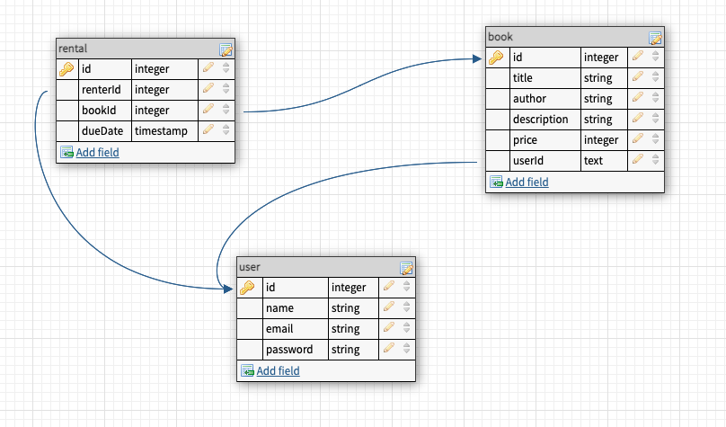

# MyBookStore
## Description
* MybookStore is a demo web based app where customers can search through the website an add book to their wishlist. customers can browse any types of book by the tittle and author. 
## MVP Goals
* Create a home page and see a search form
* User enters a term and submits a form 
* Setup Database 
* Create books model and table 
* create RESTful routing
* Add functionality to the routes
* Link the login forms to the login fields
* On submit button clicked, the user will be created in the database and userId cookie is set to that user's id

## Stretch Goals

* Add a shopping cart 
* when user add books in the shopping cart, user can have access to purchase with fake card 
* purchased booked will be saved in to purchase history page
* only the logged in user can access purchase history page
* Add rent button
* Rented booked will be stored in to the history only for short period of time 

## User Stories

* As a user, I want to search any book 
* As a user, I want to create an account
* As a user, I want to Login/Logout
* As a user, I want to select and save books in to wishlist
* As a logged in user, I want to access my saved books 
* As a logged in user, I want to update/ delete my wish list books

## Daily Sprints

- Monday:
      * test API
      * wireframe app
      * plan database ERD
      * plan routes
    - Tuesday:
      * create db models -- test db
      * stub routes -- test routes
      * build routes
    - Wednesday:
      * finish routes
      * create views
    - Thursday:
      * finish views
      * mvp
    - Friday:
      * debug refactor
      * style views
    - Saturday:
      * style views
      * stretch goals
    - Sunday:
      * stretch goals

### RESTful routing chart

| Method | URL | Functionality | view |
|--------|-----|---------------|------|
| GET  | /books | list all books | show books/index.ejs
| POST | /books | add a book to wishlist | redirect to /user/wishlistBooks
| GET  | /books/:id | show one book |  redirect to /wishlist
| DELETE | /books/:id | delete one book | redirect to /books
| POST | /user/book | add a book to wishlist | redirect to /user/wishlistBooks
| DELETE | /user/:id/book/:id | delete one book|  redirect to /wishlist

### User RESTful routing chart
| Method | URL | Functionality | view |
|--------|-----|---------------|------|
| GET | /user/new | show sign up page | redirect to /user/new.ejs
| POST  | /user | create new user |  redirect to '/'
| GET | /user/login | show log in page | render to /user/login
| POST | /user/login | login user | redirect to '/'
| GET | /user/wishlistbook | show wish list page|  redirect to /user/wishlist

### Rental RESTful routing chart
| Method | URL | Functionality | view |
|--------|-----|---------------|------|
| GET | /user/rental | show rented books | redirect to /user/rental.ejs
| POST | /user/rental | add new rental book | redirect to /user/rental.ejs
| DELETE | /user/:id/book/:id | delete one book|  redirect to /rental.ejs

## Wireframes

## ERDs

